# BAGANA AI

**BAGANA AI** is an AI-powered platform for agencies that helps teams quickly create clear PRD and MRD documents for client campaigns and internal projects. Powered by a chat-based assistant using the AAMAD Framework, it guides agencies through defining problems, requirements, and market insights, then presents everything in a simple, executive-ready dashboard that makes collaboration and decision-making faster.

This project is built using the **AAMAD (AI-Assisted Multi-Agent Application Development) Framework** – an open, production-grade framework for building, deploying, and evolving multi-agent applications using best context engineering practices.

---

## Table of Contents

- [About BAGANA AI](#about-bagana-ai)
- [Project Status](#project-status)
- [AAMAD Framework](#aamad-framework)
- [AAMAD phases at a glance](#aamad-phases-at-a-glance)
- [Repository Structure](#repository-structure)
- [Getting Started](#getting-started)
- [Phase 1: Define Workflow (Product Manager)](#phase-1-define-workflow-product-manager)
- [Phase 2: Build Workflow (Multi-Agent)](#phase-2-build-workflow-multi-agent)
- [Core Concepts](#core-concepts)
- [Contributing](#contributing)
- [License](#license)

---

## About BAGANA AI

BAGANA AI is designed to solve the critical pain point agencies face when creating Product Requirements Documents (PRD) and Market Research Documents (MRD). Traditional methods are time-consuming (3-5 days per document), require multiple revision cycles, and often result in incomplete or inconsistent documentation.

**Key Features:**
- 🤖 AI-powered chat assistant that guides users through structured PRD/MRD creation
- 📊 Executive-ready dashboard for visualization and collaboration
- 🔄 Multi-agent architecture using CrewAI for specialized expertise
- 📝 Built on AAMAD Framework ensuring production-grade architecture
- ⚡ 70% reduction in document creation time

**Target Users:**
- Product Managers and Project Managers at agencies
- Business Analysts and Strategy Consultants
- Agency Executives and Account Directors
- Client Stakeholders and External Collaborators

For detailed requirements and specifications, see the [Product Requirements Document](./project-context/1.define/prd.md) and [Market Research Document](./project-context/1.define/mrd.md).

---

## Project Status

**Current Phase:** Phase 1 - Define ✅

- ✅ **PRD Created**: [Product Requirements Document](./project-context/1.define/prd.md)
- ✅ **MRD Created**: [Market Research Document](./project-context/1.define/mrd.md)
- ✅ **SAD Created**: [System Architecture Document](./project-context/1.define/sad.md)
- ⏳ **Development**: Build phase (pending)

---

## AAMAD Framework

**AAMAD** is a context engineering framework based on best practices in AI-assisted coding and multi-agent system development methodologies.  
It enables teams to:

- Launch projects with autonomous or collaborative AI agents
- Rapidly prototype MVPs with clear context boundaries
- Use production-ready architecture/design patterns
- Accelerate delivery, reduce manual overhead, and enable continuous iteration

BAGANA AI leverages the AAMAD Framework to ensure systematic, auditable, and production-ready development.

---

## AAMAD phases at a glance

AAMAD organizes work into three phases: Define, Build, and Deliver, each with clear artifacts, personas, and rules to keep development auditable and reusable. 
The flow begins by defining context and templates, proceeds through multi‑agent build execution, and finishes with operational delivery.

```mermaid
flowchart LR
  %% AAMAD phases overview
  subgraph P1[DEFINE]
    D1H[ PERSONA ]:::hdr --> D1L["• Product Manager<br/>(@product-mgr)"]:::list
    D2H[TEMPLATES]:::hdr --> D2L["• Market Research<br/>• PRD"]:::list
  end

  subgraph P2[BUILD]
    B1H[AGENTS]:::hdr --> B1L["• Project Mgr<br/>• System Architect<br/>• Frontend Eng<br/>• Backend Eng<br/>• Integration Eng<br/>• QA Eng"]:::list
    B2H[RULES]:::hdr --> B2L["• core<br/>• development‑workflow<br/>• adapter‑crewai"]:::list
  end

  subgraph P3[DELIVER]
    L1H[AGENTS]:::hdr --> L1L["• DevOps Eng"]:::list
    L2H[RULES]:::hdr --> L2L["• continuous‑deploy<br/>• hosting‑environment<br/>• access‑control"]:::list
  end

  P1 --> P2 --> P3

  classDef hdr fill:#111,stroke:#555,color:#fff;
  classDef list fill:#222,stroke:#555,color:#fff;
``` 



- Phase 1: (Define)
    - Product Manager persona (`@product-mgr`) conducts prompt-driven discovery and context setup, supported by templates for Market Research Document (MRD) and Product Requirements Document (PRD), to standardize project scoping.

- Phase 2: (Build)
    - Multi‑agent execution by Project Manager, System Architect, Frontend Engineer, Backend Engineer, Integration Engineer, and QA Engineer, governed by core, development‑workflow, and CrewAI‑specific rules.

- Phase 3: (Deliver)
    - DevOps Engineer focuses on release and runtime concerns using rules for continuous deployment, hosting environment definitions, and access control.


---

## Repository Structure

    bagana-ai-AI-dev/
    ├─ .cursor/
    │ ├─ agents/ # Agent persona markdown files (definitions & actions)
    │ ├─ prompts/ # Parameterized and phase-specific agent prompts
    │ ├─ rules/ # Architecture, workflow, and epics rules/patterns
    │ └─ templates/ # Generation templates for research, PRD, SAD, etc.
    ├─ project-context/
    │ ├─ 1.define/ # Project-specific PRD, MRD, SAD, research reports, etc.
    │ │   ├─ prd.md # ✅ BAGANA AI Product Requirements Document
    │ │   ├─ mrd.md # ✅ Market Research Document
    │ │   └─ sad.md # ✅ System Architecture Document
    │ ├─ 2.build/ # Output artifacts for setup, frontend, backend, etc.
    │ └─ 3.deliver/ # QA logs, deploy configs, release notes, etc.
    ├─ CHECKLIST.md # Step-by-step execution guide
    ├─ README.md # This file
    └─ usecase.txt # Project use case definition


**Framework artifacts** (in `.cursor/`) are reusable AAMAD framework components.  
**Project-context** contains all generated and instance-specific documentation for BAGANA AI.

---

## Getting Started

### Prerequisites

- Python 3.10+ or uv package manager
- Git
- CursorAI or compatible AI coding assistant (recommended)

### Installation

1. **Clone this repository.**
   ```bash
   git clone https://github.com/louistherhansen/bagana-ai-AI-dev.git
   cd bagana-ai-AI-dev
   ```

2. **Install AAMAD Framework** (if not already included):
   ```bash
   uv venv
   uv pip install aamad
   uv run aamad init
   ```

3. **Set environment variables.**  
   Create a `.env` (or export in your shell) with at least:
   ```bash
   # Current default multi-agent framework adapter (see .cursor/rules/adapter-registry.mdc)
   AAMAD_ADAPTER=crewai
   ```
   The orchestrator loads `.cursor/rules/adapter-${AAMAD_ADAPTER}.mdc`; if unset, it defaults to `crewai`. Add other variables (e.g. LLM API keys) as required by the SAD/PRD.

4. **Review the PRD**: Start by reading the [Product Requirements Document](./project-context/1.define/prd.md) to understand the project scope and requirements.

5. **Follow the Development Workflow**: Use `CHECKLIST.md` to guide multi-agent development phases.

### Development Workflow

1. Confirm `.cursor/` contains the full agent, prompt, and rule set.
2. Follow the `CHECKLIST.md` to run using multi-agent autonomy — typically, via CursorAI or another coding agent platform.
3. Each agent persona executes its epic(s), producing separate markdown artifacts and code as they go.
4. Review, test, and launch the MVP, then iterate or scale with additional features.

---

## Phase 1: Define Stage (Product Manager)

The Product Manager persona (`@product-mgr`) conducts prompt-driven discovery and context setup to standardize project scoping:

- ✅ **Requirements:** [Product Requirements Document (PRD)](./project-context/1.define/prd.md)
- ✅ **Market Research:** [Market Research Document (MRD)](./project-context/1.define/mrd.md) — template: `.cursor/templates/mr-template.md`
- ✅ **Architecture:** [System Architecture Document (SAD)](./project-context/1.define/sad.md) — template: `.cursor/templates/sad-template.md`
- ⏳ **Context Summary:** Create comprehensive context handoff artifacts for technical teams
- ⏳ **Validation:** Ensure completeness of market analysis, user personas, feature requirements, and success metrics

Phase 1 outputs are stored in `project-context/1.define/` and provide the foundation for all subsequent development phases.

**Current Status:** PRD, MRD, and SAD completed. Ready to begin Phase 2 (Build).

---

## Phase 2: Build Stage (Multi-Agent)

Each role is embodied by an agent persona, defined in `.cursor/agents/`.  
Phase 2 is executed by running each epic in sequence after completing Phase 1:

- **Architecture:** Generate solution architecture document (`sad.md`)
- **Setup:** Scaffold environment, install dependencies, and document (`setup.md`)
- **Frontend:** Build UI + placeholders, document (`frontend.md`)
- **Backend:** Implement backend, document (`backend.md`)
- **Integration:** Wire up chat flow, verify, document (`integration.md`)
- **Quality Assurance:** Test end-to-end, log results and limitations (`qa.md`)

Artifacts are versioned and stored in `project-context/2.build` for traceability.

---

## Core Concepts

- **Persona-driven development:** Each workflow is owned and documented by a clear AI agent persona with a single responsibility principle.
- **Context artifacts:** All major actions, decisions, and documentation are stored as markdown artifacts, ensuring explainability and reproducibility.
- **Parallelizable epics:** Big tasks are broken into epics, making development faster and more autonomous while retaining control over quality.
- **Reusability:** Framework reusable for any project—simply drop in your PRD/SAD and let the agents execute.
- **Open, transparent, and community-driven:** All patterns and artifacts are readable, auditable, and extendable.

---

## Contributing

Contributions are welcome!  
- Open an issue for bugs/feature ideas/improvements.
- Submit pull requests with extended templates, new agent personas, or bug fixes.
- Help evolve the knowledge base and documentation for greater adoption.
- When modifying `.cursor/` or `project-context/`, run `python scripts/update_bundle.py` to refresh the packaged artifact bundle before publishing.

---

## License

Licensed under Apache License 2.0.

> Why Apache-2.0
>    Explicit patent grant and patent retaliation protect maintainers and users from patent disputes, which is valuable for AI/ML methods, agent protocols, and orchestration logic.
>    Permissive terms enable proprietary or closed-source usage while requiring attribution and change notices, which encourages integration into enterprise stacks.
>    Compared to MIT/BSD, Apache-2.0 clarifies modification notices and patent rights, reducing legal ambiguity for contributors and adopters.

---

---

## Quick Links

- 📋 [Product Requirements Document (PRD)](./project-context/1.define/prd.md) — Product specifications
- 📊 [Market Research Document (MRD)](./project-context/1.define/mrd.md) — Market and opportunity analysis
- 🏗️ [System Architecture Document (SAD)](./project-context/1.define/sad.md) — Architecture and technical blueprint
- 📝 [Use Case](./usecase.txt) — Project use case definition
- ✅ [Checklist](./CHECKLIST.md) — Step-by-step execution guide
- 📚 [AAMAD Templates](./.cursor/templates/) — Framework templates (PRD, MR, SAD, etc.)
- 👥 [Agent Personas](./.cursor/agents/) — Agent definitions

---

> For detailed step-by-step Phase 2 execution, see [CHECKLIST.md](./CHECKLIST.md).  
> For advanced reference and prompt engineering, see `.cursor/templates/` and `.cursor/rules/`.

